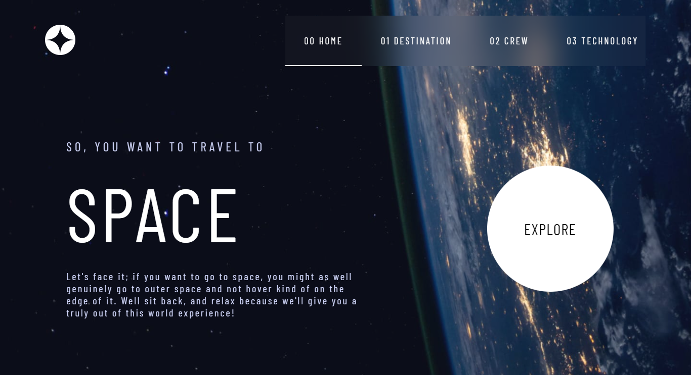

# space-tourism-website

## Demo
*Check out the live demo: [Space Tourism Website Demo](https://asmaasaleh185.github.io/space-tourism-website/)*
## Introduction
*The Space Tourism Website is a modern web application designed to provide an immersive experience for users interested in space travel. Explore destinations, crew members, and spacecraft, all in a sleek and interactive design.*

## Features
- *Destination Information: Learn about different planets and moons available for space tourism.*
- *Crew Details: Get to know the crew members who will be part of your journey.*
- *Technology Showcase: Discover the cutting-edge technology used in space travel.*
## Technologies Used
- *HTML: For structuring the content.*
- *CSS: To style the website and create a visually appealing layout.*
- *JavaScript: For dynamic content and interactivity.*
- *Responsive Design: Ensures the website looks great on all devices.*
- *Flexbox: For layout management.*
## Usage
*Once the website is open, you can:*

- *Navigate between different sections such as Destination, Crew, and Technology.*
- *Click on each destination to learn more about the planets and spacecraft.*
- *View crew member profiles and read about the technology behind space travel.*